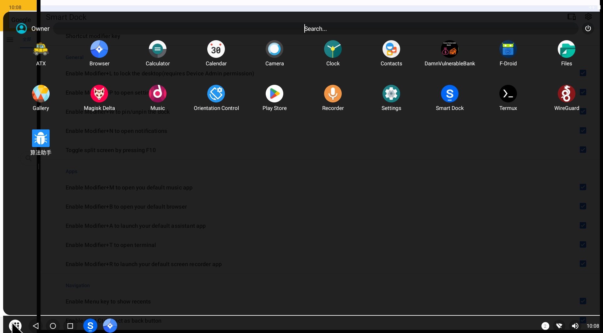

### 手工下载OTA安装waydroid

#### Fedora38 安装 waydroid
```sh
sudo dnf install waydroid
sudo systemctl enable --now waydroid-container
# first-luanch, initialization
# System OTA: https://ota.waydro.id/system
# Vendor OTA: https://ota.waydro.id/vendor
```

#### 手工下载OTA安装Image
```sh
cd ~/Downloads

# https://github.com/waydroid/OTA/blob/master/system/lineage/waydroid_x86_64/VANILLA.json
wget https://sourceforge.net/projects/waydroid/files/images/system/lineage/waydroid_x86_64/lineage-18.1-20230819-VANILLA-waydroid_x86_64-system.zip/download

# https://github.com/waydroid/OTA/blob/master/vendor/waydroid_x86_64/MAINLINE.json
wget https://sourceforge.net/projects/waydroid/files/images/vendor/waydroid_x86_64/lineage-18.1-20230819-MAINLINE-waydroid_x86_64-vendor.zip/download

# 解压ZIP包中的system.img,vendor.img到此目录/usr/share/waydroid-extra/images/
# 终端命令行系统初始化
sudo waydroid init -f -c https://ota.waydro.id/system -v https://ota.waydro.id/vendor

# 终端命令行系统初始化且启动
waydroid first-launch
```

#### 安装应用
```sh
cd ~/Downloads
waydroid app install F-Droid.apk
```

#### 启用代理
```sh
# 设置代理
sudo waydroid shell settings put global http_proxy "192.168.100.196:7890"
sudo waydroid shell settings put global https_proxy "192.168.100.196:7890"
# 重启当前会话
waydroid session stop
waydroid session start
```

#### 禁显应用图标, waydroid.*.desktop中添加NoDisplay=true
```ini
# ~/.local/share/applications/waydroid.*.desktop中添加NoDisplay=true
[Desktop Entry]
Type=Application
Name=Clock
Exec=waydroid app launch com.android.deskclock
Icon=/home/kaguya/.local/share/waydroid/data/icons/com.android.deskclock.png
NoDisplay=true
Categories=X-WayDroid-App;
X-Purism-FormFactor=Workstation;Mobile;
Actions=app_settings;
[Desktop Action app_settings]
Name=App Settings
Exec=waydroid app intent android.settings.APPLICATION_DETAILS_SETTINGS package:com.android.deskclock
```

#### 修复安卓应用竖屏问题
```sh
sudo waydroid shell wm set-fix-to-user-rotation enabled
```

#### 竖屏启机
```sh
# 重置到默认设置，以便全屏
$ waydroid prop set persist.waydroid.width ""
$ waydroid prop set persist.waydroid.height ""

# 计算宽度，以竖屏 1366X768 16:9为例，width = 768/16*9 = 432
$ waydroid prop set persist.waydroid.width 432

＃ 重启
$ waydroid session stop
$ waydroid show-full-ui
```

#### 安卓DPI信息
- MDPI (Medium Dots per Inch):    Resolution: 160 DPI (Dots per Inch)    Image resolution: 1x baseline (mdpi)    Example image size: 48x48 pixels
- HDPI (High Dots per Inch):    Resolution: 240 DPI (Dots per Inch)    Image resolution: 1.5x baseline (hdpi)    Example image size: 72x72 pixels
- XHDPI (Extra High Dots per Inch):    Resolution: 320 DPI (Dots per Inch)    Image resolution: 2x baseline (xhdpi)    Example image size: 96x96 pixels
- XXHDPI (Extra Extra High Dots per Inch):    Resolution: 480 DPI (Dots per Inch)    Image resolution: 3x baseline (xxhdpi)    Example image size: 144x144 pixels

#### 开启安卓开发者模式，设置DPI
1. Setting->About phone->Build number(dblclick)
2. Setting->System->Advanced->Developer Options->DRAWING(SmallestWidth:320)

#### adb connect Waydroid
```sh
# 在Waydroid查看IpAddress, Setting->About phone->Ip Address
$ adb connect 192.168.240.112:5555

# 查看设备
$ adb devices 
```

#### Waydroid管理APP
```sh
# 安装，app install
waydroid app install app-release.apk
# 运行, app launch
waydroid app launch asvid.github.io.fridaapp
# 删除, app remove
waydroid app remove asvid.github.io.fridaapp
```

#### Smart Dock 快捷键
- Modifier + L, 锁屏
- Modifier + K, 截屏
- Modifier + P, 设置
- Modifier + W, 钉屏^[[安卓钉屏功能](https://support.google.com/android/answer/9455138?hl=zh-Hans&sjid=9320511781645990179-AP "安卓使用入门－固定和取消固定屏幕")
]
- Modifier + N, 通知
- Modifier + M, 音乐
- Modifier + B, 浏览器
- Modifier + A, assistant app
- Modifier + T, 终端
- Modifier + R, 录屏
- Ctrl(right),  返回（右Ctrl键即安卓返回）
- F10, 切换屏幕


#### Uiautomator2 连接 Waydroid
```python
import uiautomator2 as u2

# 192.168.240.112 是你的安卓联网后的IP地址
d = u2.connect_adb_wifi('192.168.240.112')
print(d.info)

# d.info 返回如下数据
# {'currentPackageName': 'cu.axel.smartdock', 'displayHeight': 736, 'displayRotation': 0, 
#'displaySizeDpX': 1214, 'displaySizeDpY': 654, 'displayWidth': 1366, 
# 'productName': 'lineage_waydroid_x86_64', 'screenOn': True, 'sdkInt': 30, 'naturalOrientation': True}
```
